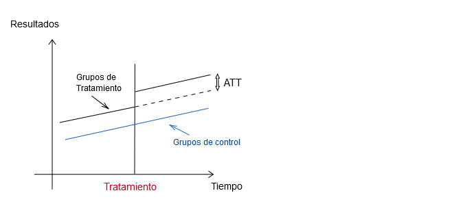

```{r xaringan-themer, include=FALSE, warning=FALSE}
library(xaringanthemer)
style_duo_accent(
  primary_color = "#1b9aaa",
  secondary_color = "#ffc43d",
  text_font_google = google_font("Ubuntu"),  #<< Prueba 1
  header_font_google = google_font("Josefin Sans") #<< Prueba2
)
```

```{r, setup, include = F}
# devtools::install_github("dill/emoGG")
library(pacman)
p_load(ggthemes, readxl, viridis, broom, emoGG, ggdag, gganimate, knitr, dslabs, gapminder, extrafont, Ecdat, wooldridge, tidyverse, magrittr, janitor, kableExtra, gridExtra, ggforce, fontawesome, shiny, babynames, broom, ggplot2, ggridges)
# Define colors
# Define pink color
red_pink <- "#e64173"
turquoise <- "#20B2AA"
orange <- "#FFA500"
red <- "#fb6107"
blue <- "#2b59c3"
green <- "#8bb174"
grey_light <- "grey70"
grey_mid <- "grey50"
grey_dark <- "grey20"
purple <- "#6A5ACD"
slate <- "#314f4f"
met_slate <- "#272822"
# Dark slate grey: #314f4f
# Opciones
opts_chunk$set(
  comment = "#>",
  fig.align = "center",
  fig.height = 7,
  fig.width = 10.5,
  warning = F,
  message = F
)
opts_chunk$set(dev = "svg")
options(device = function(file, width, height) {
  svg(tempfile(), width = width, height = height)
})
options(crayon.enabled = F)
options(knitr.table.format = "html")
# A blank theme para ggplot
theme_empty <- theme_bw() + theme(
  line = element_blank(),
  rect = element_blank(),
  strip.text = element_blank(),
  axis.text = element_blank(),
  plot.title = element_blank(),
  axis.title = element_blank(),
  plot.margin = structure(c(0, 0, -0.5, -1), unit = "lines", valid.unit = 3L, class = "unit"),
  legend.position = "none"
)
theme_simple <- theme_bw() + theme(
  line = element_blank(),
  panel.grid = element_blank(),
  rect = element_blank(),
  strip.text = element_blank(),
  axis.text.x = element_text(size = 18, family = "STIXGeneral"),
  axis.text.y = element_blank(),
  axis.ticks = element_blank(),
  plot.title = element_blank(),
  axis.title = element_blank(),
  # plot.margin = structure(c(0, 0, -1, -1), unit = "lines", valid.unit = 3L, class = "unit"),
  legend.position = "none"
)
theme_axes_math <- theme_void() + theme(
  text = element_text(family = "MathJax_Math"),
  axis.title = element_text(size = 22),
  axis.title.x = element_text(hjust = .95, margin = margin(0.15, 0, 0, 0, unit = "lines")),
  axis.title.y = element_text(vjust = .95, margin = margin(0, 0.15, 0, 0, unit = "lines")),
  axis.line = element_line(
    color = "grey70",
    size = 0.25,
    arrow = arrow(angle = 30, length = unit(0.15, "inches")
  )),
  plot.margin = structure(c(1, 0, 1, 0), unit = "lines", valid.unit = 3L, class = "unit"),
  legend.position = "none"
)
theme_axes_serif <- theme_void() + theme(
  text = element_text(family = "MathJax_Main"),
  axis.title = element_text(size = 22),
  axis.title.x = element_text(hjust = .95, margin = margin(0.15, 0, 0, 0, unit = "lines")),
  axis.title.y = element_text(vjust = .95, margin = margin(0, 0.15, 0, 0, unit = "lines")),
  axis.line = element_line(
    color = "grey70",
    size = 0.25,
    arrow = arrow(angle = 30, length = unit(0.15, "inches")
  )),
  plot.margin = structure(c(1, 0, 1, 0), unit = "lines", valid.unit = 3L, class = "unit"),
  legend.position = "none"
)
theme_axes <- theme_void() + theme(
  text = element_text(family = "Fira Sans Book"),
  axis.title = element_text(size = 18),
  axis.title.x = element_text(hjust = .95, margin = margin(0.15, 0, 0, 0, unit = "lines")),
  axis.title.y = element_text(vjust = .95, margin = margin(0, 0.15, 0, 0, unit = "lines")),
  axis.line = element_line(
    color = grey_light,
    size = 0.25,
    arrow = arrow(angle = 30, length = unit(0.15, "inches")
  )),
  plot.margin = structure(c(1, 0, 1, 0), unit = "lines", valid.unit = 3L, class = "unit"),
  legend.position = "none"
)
theme_set(theme_gray(base_size = 20))
# Nombres de las columnas para la regresión
reg_columns <- c("Term", "Est.", "S.E.", "t stat.", "p-Value")
# Formato de p valores
format_pvi <- function(pv) {
  return(ifelse(
    pv < 0.0001,
    "<0.0001",
    round(pv, 4) %>% format(scientific = F)
  ))
}
format_pv <- function(pvs) lapply(X = pvs, FUN = format_pvi) %>% unlist()
# Tidy regression results table
tidy_table <- function(x, terms, highlight_row = 1, highlight_color = "black", highlight_bold = T, digits = c(NA, 3, 3, 2, 5), title = NULL) {
  x %>%
    tidy() %>%
    select(1:5) %>%
    mutate(
      term = terms,
      p.value = p.value %>% format_pv()
    ) %>%
    kable(
      col.names = reg_columns,
      escape = F,
      digits = digits,
      caption = title
    ) %>%
    kable_styling(font_size = 20) %>%
    row_spec(1:nrow(tidy(x)), background = "white") %>%
    row_spec(highlight_row, bold = highlight_bold, color = highlight_color)
}
# A few extras
xaringanExtra::use_xaringan_extra(c("tile_view", "fit_screen"))
```

name: xaringan-title
class: inverse, left, bottom
background-image: url(images/beach1.jpg)
background-size: cover

# **`r rmarkdown::metadata$title`**
----

## **`r rmarkdown::metadata$subtitle`**

### `r rmarkdown::metadata$author`
### `r rmarkdown::metadata$date`

```{r xaringanExtra-share-again, echo=FALSE}
xaringanExtra::use_share_again()
```

---
# Estimador de Diferencias en Diferencias

--

- Es un método de .hi-turquoise[inferencia causal]

--

> Es un método general para cuando surge una política exógena
que afecta más a un grupo que a otro

--

- Se utiliza con datos de corte transversal repetidos a lo largo del tiempo

--

- También puede utilizarse comparando .hi-pink[subgrupos].

--

DID se basa fundamentalmente en un supuesto denominado .ul[tendencias paralelas]. En ausencia de tratamiento, las tendencias de los grupos tratados y no tratados son iguales.

---
# Estimador de Diferencias en Diferencias

--




---
# Estimador de Diferencias en Diferencias

--

### Dif-en-Dif, ¿Qué estima?

--

$$\tau_{dif-en-dif}= [\mathbb{E}(Y_{2}|D=1)-\mathbb{E}(Y_{1}|D=1) ] - [ \color{blue}{ \mathbb{E}(Y_{2}|D=0)-\mathbb{E}(Y_{1}|D=0)}]$$

--

Donde:

- La *primera* parte es el cambio .ul[esperado] entre el periodo anterior y el posterior a la implementación del .hi-pink[tratamiento] para los **tratados**.

--

- La *segunda* parte es el cambio .ul[esperado] entre el periodo anterior y el posterior a la implementación del .hi-pink[tratamiento] para los .hi-purple[controles].

---
# Estimador de Diferencias en Diferencias

--

### Análogo muestral

--

$$\tau_{dif-en-dif}= [(\bar{Y}_{2}|D=1)-(\bar{Y}_{1}|D=1) ] - [ \color{blue}{ (\bar{Y}_{2}|D=0)-(\bar{Y}_{1}|D=0)} ]$$

--

Lo cual, se puede simplificar si se plantea el cambio temporal (longitudinal), que puede definirse como $\triangle Y$:

--

$$\boxed{ \widehat{\tau}_{dif-en-dif}= (\triangle \bar{Y}|D=1)- (\triangle \bar{Y}|D=0)}$$

---
# Estimador de Diferencias en Diferencias

--

### ¿Cuándo usar el estimador DIF-en-DIF o DID?

--

- El estimador **DID** es más .hi[eficiente] que el de diferencia cuando algunos determinantes *no observables* de la variable .ul[objetivo] son persistentes en el tiempo.

--

- La eficiencia va en dirección de la fracción de la varianza de $Y$ que este explicada por factores no observados.

--

- Cuando (*no hay balance*) entre grupo de .hi-purple[control] y .hi-pink[tratamiento] aún con asignación aleatoria se generan asignaciones parcialmente aleatorias.

--

- Si el .hi-pink[tratamiento] esta **correlacionado** con el nivel inicial de $Y$ antes de la intervención, ese estimador de diferencias será .ul[sesgado]. Pero el .hi-orange[Dif-en-Dif] no necesariamente.

---
class: inverse, middle

# DID en entorno de dos periodos


---
# DID en dos periodos de tiempo

--

> Consideremos un experimento que se hizo naturalmente, pero que iba interviniendo un grupo mas que otro.

--

Vamos a decir que $\color{purple}{Y_i}$ es la variable .hi-purple[resultado] y $D_i$ es la de **tratamiento**.

--

Esto es : $D_i=1$ si es tratado y $D_i=0$, de lo contrario.

--

### Método 1: Comparando T-C en un mismo momento de tiempo

--

$$\text{Efecto del Tratamiento}= \overline{Y}\; \text{para tratados} - \overline{Y}\; \color{purple}{\text{para no tratados}}$$

--

$$\tau=\overline{Y}_{1i}-\color{purple}{\overline{Y}_{0i}}$$

--

`r fa("info-circle", fill="red")` Lo único que nos puede llevar hacer las cosas mal, son las diferencias de características de los individuos que estamos evaluando

---
count: false
# DID en dos periodos de tiempo


> Consideremos un experimento que se hizo naturalmente, pero que iba interviniendo un grupo mas que otro.


Vamos a decir que $\color{purple}{Y_i}$ es la variable .hi-purple[resultado] y $D_i$ es la de **tratamiento**.


Esto es : $D_i=1$ si es tratado y $D_i=0$, de lo contrario.

--

### Método 2: Comparando T-T Antes y despues

--

$$\text{Efecto del Tratamiento}= \overline{Y}\; \text{para tratados en}\;|\;t=0 - \overline{Y}\; \color{red}{\text{para tratados en}}\;|\;t=1$$

--

$$\tau=\overline{Y}_{1t=0}-\color{purple}{\overline{Y}_{1t=1}}$$

--

`r fa("info-circle", fill="red")` Lo único que nos puede llevar hacer las cosas mal, es que en el tiempo (*todo evoluciona/cambia*) y es complejo separar eso así no mas!!

---
class: inverse
# Bibliografía

`r fa('book')` Angrist, J. D., & Pischke, J. S. (2009). *Mostly harmless econometrics: An empiricist's companion*. Princeton university press.

`r fa('file-code')` Rubin, E. (2021) *Econometrics Lectures class*.

`r fa('file-code')` Raze, K. (2022) *Labor Economics Lectures class*.

`r fa('youtube')` Angrist, J. (2022) *Mastering Econometrics* [Con Acceso abril 2022](https://mru.org/mastering-econometrics-joshua-angrist).

`r fa('book')` Wooldridge, J. M. (2015). *Introductory econometrics: A modern approach*. Cengage learning.


---
name: adios
class: middle, inverse

.pull-left[
# **¡Gracias!**
<br/>
## Econometría

### Seguimos aprendiendo
]

.pull-right[
.right[


[`r fontawesome::fa("link")` Syllabus/ Curso](https://carlosyanes.netlify.app/contenidoc/SyllabusEconometriaME.pdf)<br/>
[`r fontawesome::fa("twitter")` @keynes37](https://twitter.com/keynes37)<br/>
[`r fontawesome::fa("envelope")` cayanes@uninorte.edu.co](mailto:cayanes@uninorte.edu.co)
]
]


    
    