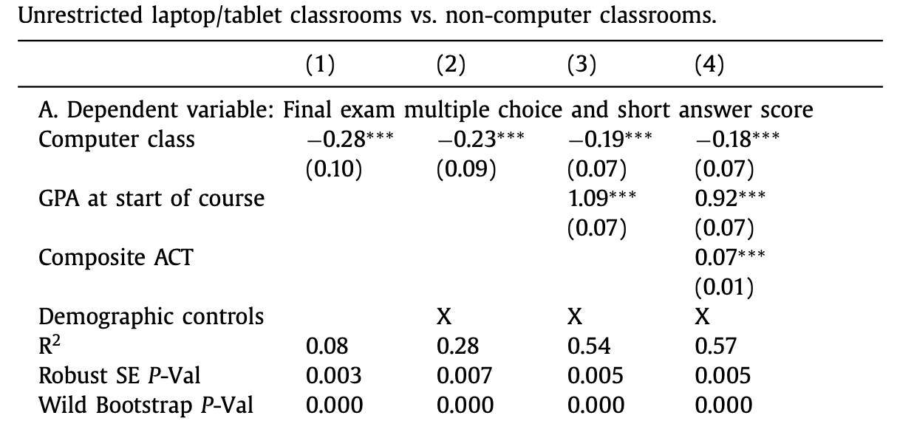

```{r xaringan-themer, include=FALSE, warning=FALSE}
library(xaringanthemer)
style_duo_accent(
  primary_color = "#1b9aaa",
  secondary_color = "#ffc43d",
  text_font_google = google_font("Ubuntu"),  #<< Prueba 1
  header_font_google = google_font("Josefin Sans") #<< Prueba2
)
```

```{r, setup, include = F}
# devtools::install_github("dill/emoGG")
library(pacman)
p_load(
  broom, tidyverse,
  latex2exp, ggplot2, ggthemes, ggforce, viridis, extrafont, gridExtra,
  kableExtra, snakecase, janitor,
  data.table, dplyr, estimatr,
  lubridate, knitr, parallel,
  lfe, emoGG,
  here, magrittr, fontawesome, shiny, babynames
)
# Define pink color
red_pink <- "#e64173"
turquoise <- "#20B2AA"
orange <- "#FFA500"
red <- "#fb6107"
blue <- "#2b59c3"
green <- "#8bb174"
grey_light <- "grey70"
grey_mid <- "grey50"
grey_dark <- "grey20"
purple <- "#6A5ACD"
slate <- "#314f4f"
met_slate <- "#272822"
# Dark slate grey: #314f4f
# Opciones
opts_chunk$set(
  comment = "#>",
  fig.align = "center",
  fig.height = 7,
  fig.width = 10.5,
  warning = F,
  message = F
)
opts_chunk$set(dev = "svg")
options(device = function(file, width, height) {
  svg(tempfile(), width = width, height = height)
})
options(crayon.enabled = F)
options(knitr.table.format = "html")
# A blank theme para ggplot
theme_empty <- theme_bw() + theme(
  line = element_blank(),
  rect = element_blank(),
  strip.text = element_blank(),
  axis.text = element_blank(),
  plot.title = element_blank(),
  axis.title = element_blank(),
  plot.margin = structure(c(0, 0, -0.5, -1), unit = "lines", valid.unit = 3L, class = "unit"),
  legend.position = "none"
)
theme_simple <- theme_bw() + theme(
  line = element_blank(),
  panel.grid = element_blank(),
  rect = element_blank(),
  strip.text = element_blank(),
  axis.text.x = element_text(size = 18, family = "STIXGeneral"),
  axis.text.y = element_blank(),
  axis.ticks = element_blank(),
  plot.title = element_blank(),
  axis.title = element_blank(),
  # plot.margin = structure(c(0, 0, -1, -1), unit = "lines", valid.unit = 3L, class = "unit"),
  legend.position = "none"
)
theme_axes_math <- theme_void() + theme(
  text = element_text(family = "MathJax_Math"),
  axis.title = element_text(size = 22),
  axis.title.x = element_text(hjust = .95, margin = margin(0.15, 0, 0, 0, unit = "lines")),
  axis.title.y = element_text(vjust = .95, margin = margin(0, 0.15, 0, 0, unit = "lines")),
  axis.line = element_line(
    color = "grey70",
    size = 0.25,
    arrow = arrow(angle = 30, length = unit(0.15, "inches")
  )),
  plot.margin = structure(c(1, 0, 1, 0), unit = "lines", valid.unit = 3L, class = "unit"),
  legend.position = "none"
)
theme_axes_serif <- theme_void() + theme(
  text = element_text(family = "MathJax_Main"),
  axis.title = element_text(size = 22),
  axis.title.x = element_text(hjust = .95, margin = margin(0.15, 0, 0, 0, unit = "lines")),
  axis.title.y = element_text(vjust = .95, margin = margin(0, 0.15, 0, 0, unit = "lines")),
  axis.line = element_line(
    color = "grey70",
    size = 0.25,
    arrow = arrow(angle = 30, length = unit(0.15, "inches")
  )),
  plot.margin = structure(c(1, 0, 1, 0), unit = "lines", valid.unit = 3L, class = "unit"),
  legend.position = "none"
)
theme_axes <- theme_void() + theme(
  text = element_text(family = "Fira Sans Book"),
  axis.title = element_text(size = 18),
  axis.title.x = element_text(hjust = .95, margin = margin(0.15, 0, 0, 0, unit = "lines")),
  axis.title.y = element_text(vjust = .95, margin = margin(0, 0.15, 0, 0, unit = "lines")),
  axis.line = element_line(
    color = grey_light,
    size = 0.25,
    arrow = arrow(angle = 30, length = unit(0.15, "inches")
  )),
  plot.margin = structure(c(1, 0, 1, 0), unit = "lines", valid.unit = 3L, class = "unit"),
  legend.position = "none"
)
theme_set(theme_gray(base_size = 20))
# Nombres de las columnas para la regresión
reg_columns <- c("Term", "Est.", "S.E.", "t stat.", "p-Value")
# Formato de p valores
format_pvi <- function(pv) {
  return(ifelse(
    pv < 0.0001,
    "<0.0001",
    round(pv, 4) %>% format(scientific = F)
  ))
}
format_pv <- function(pvs) lapply(X = pvs, FUN = format_pvi) %>% unlist()
# Tidy regression results table
tidy_table <- function(x, terms, highlight_row = 1, highlight_color = "black", highlight_bold = T, digits = c(NA, 3, 3, 2, 5), title = NULL) {
  x %>%
    tidy() %>%
    select(1:5) %>%
    mutate(
      term = terms,
      p.value = p.value %>% format_pv()
    ) %>%
    kable(
      col.names = reg_columns,
      escape = F,
      digits = digits,
      caption = title
    ) %>%
    kable_styling(font_size = 20) %>%
    row_spec(1:nrow(tidy(x)), background = "white") %>%
    row_spec(highlight_row, bold = highlight_bold, color = highlight_color)
}
# A few extras
xaringanExtra::use_xaringan_extra(c("tile_view", "fit_screen"))
```

name: xaringan-title
class: inverse, left, bottom
background-image: url(images/beach1.jpg)
background-size: cover

# **`r rmarkdown::metadata$title`**
----

## **`r rmarkdown::metadata$subtitle`**

### `r rmarkdown::metadata$author`
### `r rmarkdown::metadata$date`

```{r xaringanExtra-share-again, echo=FALSE}
xaringanExtra::use_share_again()
```

---
name: admin
# Recursos

.hi-slate[Para la clase]

- .note[Course website:] [Carlos Yanes](https://carlosyanes.netlify.app)
- [Syllabus](https://carlosyanes.netlify.app/contenidoc/SyllabusEconometriaME.pdf) (on the website)
- En Persona?
.hi-slate[.mono[Departamento Economía Oficina D-215]]

- .note[Hoy:] Investigación y algunas cosas en `r fa("r-project", fill = "steelblue")`
- Lecturas:
  - [Lect. 1: Métodos de evaluación](https://www.hbs.edu/ris/Supplemental%20Files/Metodos-de-Evaluacion-de-Impacto_50067.pdf) by Pomeranz (2011)
- .note[Tareas:] De acuerdo al práctico por desarrollar
- .note[Ayudas:] [La biblia del programador](https://stackoverflow.com/)

---
class: inverse, middle

# Preliminar

---
name: espacio
# Por qué estamos aquí?
--

+ .hi-orange[Investigación en economía] Intentamos siempre participar en .hi-pink[consultorias] para responder y entender el comportamiento humano, social y económico de las sociedades.

--

+ .hi-orange[Nosotros] aprendemos métodos, herramientas, habilidades y buscamos la intuición correcta para hacer .b[investigación]

--

+ .hi-orange[Econometría (aplicada)] Entender los métodos empiricos que .ul[combinan] la información, datos y los elementos estadísticos para testear/medir *teorías* y *políticas públicas*.

--

#### Requerimientos adicionales

--

+ Vamos a tratar de ser los mas curioso/as que podamos. Buscaremos hacer preguntas todo el tiempo (no solo en la clase) e intentaremos superar los retos .ul[propuestos] a lo largo de la sesión.

--

.pink[P] Cuál es la diferencia entre la *econometría* y el *data science*?

--

.blue[R] Causalidad<sup>.smallest[🎯]</sup>

---
name: research
# Por qué estamos aquí?

--

### Fundamentos de la investigación

--

El libro de Angrist y Pischke (2009) nos brinda ciertas preguntas que debemos plantearnos:

--

1. Cuál es la .hi-orange[relación causal de interés]?

--

2. Cuanto de la idea .hi-orange[experimental] logra capturar el **efecto** deseado?

--

3. Qué estrategia de .hi-orange[identificación] hay que seguir?

--

4. Cuál es el modo (test) de .hi-orange[inferencia] a utilizar?

---
# Por qué estamos aquí?

--

### Motivación

--

>`r fa("sketch", fill="blue")` .hi[Investigación] la única forma o manera de responder algún **cuestionamiento** es definitivamente investigando, indagando, curioseando. Cuando hablamos de experimentos en las *ciencias duras* nos referencia un laboratorio (entre esos animales como ratones o monos) y probamos (testeamos) un .hi-slate[tratamiento] a un grupo de ellos a los demás simplemente lo dejamos o miramos que ocurre cuando no le aplicamos ese tratamiento y son los reconocidos controles.

>En las ciencias sociales los experimientos son un poco mas complejos. Ya que no podemos *controlar* por un solo factor y desde luego no podemos testear sobre humanos y menos cuando no existen clones.

>La **estrategia** para ello, va en el efecto de la aleatorización.

---
# Por qué estamos aquí?

--

Combinamos .ul[teoría] con .b[datos] y podemos incluso hacer uso de un programa como <span style="color:lightblue"> **R** </span>

--

```{r, eval=FALSE}
install.packages("dplyr") # Para instalar el paquete a usar
library(dplyr) # Activación del paquete a usar

# Creamos una tabla de datos
datos<-data.frame(nombres=c("Cecilia Lopez", "Ignacio Mantilla","Astrid Zuniga", "José Lopez", "Pablo Alboran"), 
edad<-c(46,72,64,53,51), sueldo=c(2150,1570,1890,3600,4800))
arrange(datos, edad) # Este es un comando de dplyr y ordena segun el criterio de la variable edad
sorteo_1<-runif(5,0,1) # Generamos el sorteo de aleatorio con 5 decimales
datos<-cbind(datos,sorteo_1) # Adicionamos la nueva variable a la base

# Construimos nuestra variable de tratamiento
tratamiento<-ifelse(sorteo_1>0.7,1,0) # Condicional para crear una nueva variable
datos<-cbind(datos,tratamiento)
datos
```

---
# Por qué estamos aquí?

Combinamos .ul[teoría] con .b[datos] y podemos incluso hacer uso de un programa como <span style="color:lightblue"> **R** </span>


```{r, echo=FALSE}
#install.packages("dplyr") # Si no esta instalado
library(dplyr) #Activación del paquete a usar
set.seed(12890)

#Creamos una tabla de datos
datos<-data.frame(nombres=c("Cecilia Lopez", "Ignacio Mantilla","Astrid Zuniga", "José Lopez", "Pablo Alboran"), 
edad=c(46,72,64,53,51), sueldo=c(2150,1570,1890,3600,4800))
arrange(datos, edad) #Este es un comando de dplyr y ordena segun el criterio de la variable edad
sorteo_1=runif(5,0,1) #Generamos el sorteo de aleatorio con 5 decimales
datos<-cbind(datos,sorteo_1) #Adicionamos la nueva variable a la base

# Construimos nuestra variable de tratamiento
tratamiento=ifelse(sorteo_1>0.7,1,0) #Condicional para crear una nueva variable
datos<-cbind(datos,tratamiento)
datos
```
---
class: inverse, middle

# Por donde empezar?


---
# Por donde empezar?

--

Hay que ser .hi[cautelosos] y mirar que posiblemente vamos a encontrarnos con:

--

`r fa("briefcase", fill="red")` .hi[Efecto placebo] Donde se puede recibir una sustancia química inerte pero esta tiene efectos positivos debido a las expectativas de los sujetos o individuos. 

--

`r fa("briefcase", fill="red")` .hi[Efecto reactivo o (Hawthorne)] Cuando los participantes se comportan de forma distinta simplemente por el hecho de sentirse observados y estudiados, esto puede generar resultados poco deseables.

--

`r fa("briefcase", fill="red")` .hi[Efecto John Henry] Cuando los sujetos ***no-tratados*** trabajan duro para compensar el evento de no haber sido seleccionados en el sorteo del tratamiento.

--

`r fa("briefcase", fill="red")` .hi[Efecto de la novedad] Muchos participantes pueden afectar su comportamiento porque el tratamiento les da una novedad y se sienten mejor.

--

`r fa("briefcase", fill="red")` .hi[Efecto de características] Esto se da cuando los sujetos tienden a ser "buenos muchachos".

--

`r fa("briefcase", fill="red")` .hi[Efecto Pigmaleon] (Rosenthal & Jacobson, 1968) Las expectativas de los investigadores frente al comportamiento de los sujetos llevaba a cumplir profecías "autocumplidas".
---
class: inverse, middle

# Identificación Causal


---
# Identificación Causal

--

## El objetivo de todo

Identificar el efecto del .hi[Tratamiento] en un .hi[Resultado].

--

### La idea

Debemos (idealmente), identificar y calcular el efecto del **Tratamiento** en cada uno de los *individuos*. Esto es,

--

$$Y_{1,i} - Y_{0,i}$$

--

Donde,

--

- $Y_{1,i}$ Es el resultado de un individuo $i$ cuando $i$ recibe el tratamiento
- $Y_{0,i}$ Es el resultado de un individuo $i$ cuando $i$ .hi-pink[NO] recibe el tratamiento.
- Conocidos como **Resultados Potenciales**

---
# Identificación Causal

--

Los **datos ideales** para 10 personas

.pull-left[
```{R, datosideales, echo = F}
set.seed(4)
ideal_df <- data.frame(
  i = 1:10,
  Tratados = rep(c(1, 0), each = 5),
  Y_1i = c(runif(10, 4, 10) %>% round(2)),
  Y_0i = c(runif(10, 0, 5) %>% round(2))
) %>% 
  mutate(Y_0i = case_when(Tratados == 1 ~ Y_0i + 2, TRUE ~ Y_0i),
         Y_1i = case_when(Tratados == 0 ~ Y_1i, TRUE ~ Y_1i))
ideal_df
```
]

--

.pull-right[
Recuerde que .hi-orange[debemos] calcular el efecto para cada $i$,
$$
\begin{align}
  \tau_i = Y_{1,i} -  Y_{0,i}~,
\end{align}
$$
Debemos pensar que ese es el efecto **causal** que tiene el individuo después de haber sido intervenido.
]
---
# Identificación Causal


Los **datos ideales** para 10 personas

.pull-left[
```{R, datos_ideales_trt, echo = F}
ideal_df %>% mutate(efecto_i = Y_1i - Y_0i)
```
]


.pull-right[
Recuerde que .hi-orange[debemos] calcular el efecto para cada $i$,
$$
\begin{align}
  \tau_i = Y_{1,i} -  Y_{0,i}~,
\end{align}
$$
Debemos pensar que ese es el efecto **causal** que tiene el individuo después de haber sido intervenido.
]
---
# Identificación Causal


Los **datos ideales** para 10 personas

.pull-left[
```{R, datos_ideales_trt2, echo = F}
ideal_df %>% mutate(efecto_i = Y_1i - Y_0i)
```
]


.pull-right[
Recuerde que .hi-orange[debemos] calcular el efecto para cada $i$,
$$
\begin{align}
  \tau_i = Y_{1,i} -  Y_{0,i}~,
\end{align}
$$
Debemos pensar que ese es el efecto **causal** que tiene el individuo después de haber sido intervenido.
]

La media de los efectos del tratamiento vienen a ser .mono[=] `r transmute(ideal_df, efecto_i = Y_1i - Y_0i) %>% unlist %>% mean %>% round(2)`

Esto se denomina .hi-green[Efecto promedio del tratamiento ] (ATE) o Average Treatment Effect
---
# Identificación Causal

--

## El problema real de la inferencia causal

--

La idea principal es:

--

$$
\begin{align}
  \tau_i = \color{#e64173}{Y_{1,i}} &- \color{#9370DB}{Y_{0,i}}~,
\end{align}
$$
Esto de verdad genera un reto!!

--

- Podemos observar $\color{#e64173}{Y_{1}}$ para $i$, pero no podemos observar el estado $\color{#9370DB}{Y_{0}}$ para $i$
- Podemos observar $\color{#9370DB}{Y_{0}}$ para $i$, pero no podemos observar la parte de $\color{#e64173}{Y_{1}}$ para $i$
- Solo podemos mirar lo que *en realidad* sucede; .hi-pink[NO] podemos tener su **contrafactual**

--

**Implicaciones?** Todo lo que se .hi-slate[haga] con .hi-orange[inferencia causal] debe ser con .ul[hipótesis]


---
# Identificación Causal

Los **datos que realmente** observamos para 10 personas
.pull-left[
```{R, ideal_data_obs, echo = F}
obs_df <- ideal_df
obs_df$Y_0i[1:5] <- NA
obs_df$Y_1i[6:10] <- NA
obs_df
```
]

--

.pull-right[
Solo observamos $\color{#e64173}{Y_{1}}$ para $i \in \{1, ..., 5\}$

Tambien podemos $\color{#9370DB}{Y_{0}}$ para $i \in \{6, ..., 10\}$
 
Recuerde que .hi[no] podemos observar ambos a la vez, ni $\color{#e64173}{Y_{1,i}}$, ni tampoco $\color{#9370DB}{Y_{0,i}}$ para cualquier individuo (*no tenemos clones*)

]

--

**P:** ¿Cómo podemos estimar el .hi-green[efecto medio del tratamiento] cuando .hi-pink[no] podemos observar los efectos del tratamiento individual?
---
# Identificación Causal

--

Podemos entonces, **comparar los resultados medios** de cada grupo?

--

- Tomamos el promedio de $\color{#e64173}{Y_{1}}$ para aquello(a)s que han recibido el .hi-slate[tratamiento] (*p.e.,* la .pink[media del grupo de tratados])
- Tambien calculamos el promedio $\color{#9370DB}{Y_{0}}$ para aquello(a)s que .hi[no] han recibido el tratamiento (*p.e.,* la .purple[media del grupo de control])

--

**P:** Se puede con la .pink[media del grupo de tratados] .mono[-] .purple[la media del grupo de control] aislar el efecto causal del .hi-slate[tratamiento/intervención]?

---
# Identificación Causal

.pull-left[
```{R, ideal_data_obs_2, echo = F}
obs_df <- ideal_df
obs_df$Y_0i[1:5] <- NA
obs_df$Y_1i[6:10] <- NA
obs_df
```
]

.pull-right[
.pink[Media del grupo de tratados] .mono[=] `r round(mean(obs_df$Y_1i[1:5]), 2)`

.purple[Media del grupo de control] .mono[=] `r round(mean(obs_df$Y_0i[6:10]), 2)`

Diferencia de medias .mono[=] `r round(mean(obs_df$Y_1i[1:5]) - mean(obs_df$Y_0i[6:10]), 2)`
]

--

Diferencia de medias .mono[=] .hi-green[Efecto promedio del tratamiento] .mono[+] .hi-orange[sesgo de selección]
--
<br> $\quad$ .mono[=] .green[`r transmute(ideal_df, effect_i = Y_1i - Y_0i) %>% unlist %>% mean %>% round(2)`] .mono[+] .orange[(`r round(mean(obs_df$Y_1i[1:5]) - mean(obs_df$Y_0i[6:10]), 2)` .mono[-] `r transmute(ideal_df, effect_i = Y_1i - Y_0i) %>% unlist %>% mean %>% round(2)`)]
--
 .mono[=] .green[`r transmute(ideal_df, effect_i = Y_1i - Y_0i) %>% unlist %>% mean %>% round(2)`] .mono[+] .orange[`r round(mean(obs_df$Y_1i[1:5]) - mean(obs_df$Y_0i[6:10]), 2) - transmute(ideal_df, effect_i = Y_1i - Y_0i) %>% unlist %>% mean %>% round(2)`]

--

.orange[Sesgo de selección] .mono[≠] 0 .mono[==>] las personas que "entran" en tratamiento son diferentes

---
class: inverse, middle

# Experimentos aleatorios


---
# Experimentos aleatorios

--

.hi[Cuidado!!] el .orange[sesgo de selección] .hi[NO] me deja pasar de largo las *características* no observables y que no me permiten realizar .b[correctas] comparaciones.

--

.ex[Ejemplo:] Características como la motivación, el interés, la disciplina, etc. 

--

La .hi[asignación aleatoria] me permite reducir ese .orange[sesgo de selección].

--

Esta técnica (RTC), nos conduce -si se hace bien- a tener la garantía de la ley de los grandes números.super[1] y por ende mantener el supuesto del *ceteribus paribus*.

--

Los RTC muchas veces son complejos de realizar, por sus costos y porque en realidad se debe siempre tratar de mirar si la muestra de .hi[Tratados] y .h-purple[Controles] están por lo menos en características socio-demográficas balanceadas o se *parecen en promedio* en cuanto a lo que mencionamos anteriormente.

--

La condición en definitiva es tener .hi[grupos balanceados] por lo menos en características observables.


.footnote[.super[1] *Los matemáticos y estadísticos* han demostrado que en muestras muy grandes los individuos son iguales en promedio.]

---
# Experimentos aleatorios

--

### Ejemplo: Efectos de la desparacitación en niños

--

**Motivación:** Las lombrices intestinales son comunes entre los niños de los países mas vulnerables. Los .ul[síntomas] de estos parásitos pueden mantener a los niños en edad escolar en casa, lo que .hi[tiene efectos] en la acumulación de capital humano.

**Pregunta de política:** ¿Son las intervenciones de desparasitación en las escuelas una manera rentable de aumentar la asistencia escolar?

---
# Experimentos aleatorios

--

### Ejemplo: Efectos de la desparacitación en niños

--

**Pregunta de investigación:** ¿En qué medida aumentan la asistencia escolar las intervenciones antiparasitarias?

**P:** **¿Podríamos simplemente comparar el promedio de la asistencia a. a la escuela** entre niños con y sin acceso a medicación antiparasitaria?

--

- **R/:** Si buscamos el efecto causal, probablemente no. (¿Por qué no?)


--

**Sesgo de selección:** Las familias con acceso a medicación antiparasitaria probablemente tengan hijos más sanos también por otras razones (riqueza, acceso a agua potable, *etc.*).

- **No podemos hacer una comparación *"todo lo demás es igual"**. .mono[-->] es de esperar que las diferencias observadas se desvíen *sistemáticamente* del ATE (Efecto promedio del tratamiento).

---
# Experimentos aleatorios

--

### Ejemplo: Efectos de la desparacitación en niños

--

**Solución:** Corramos un experimento.

--

Imagine un RTC donde tenemos dos grupos:

- .hi[Tratados:] Aldeas donde los niños reciben medicación antiparasitaria en la escuela.
- .hi-purple[Control:] Aldeas donde los niños no reciben medicación antiparasitaria en la escuela (statu quo).

--

Al aleatorizar las aldeas en .hi[tratados] o .hi-purple[control], incluiremos, por término medio, todo tipo de aldeas (pobres _vs._ menos pobres, acceso a agua limpia _vs._ agua contaminada, hospital _vs._ sin hospital, *etc.*) en ambos grupos.

--

*Todo lo demás igual*!

---
class: clear-slide

.hi-slate[72 aldeas] 
```{R, plot1, echo = F, dev = "svg", fig.height = 5.5}
xd <- 12
yd <- 6
set.seed(123)
med_df <- expand.grid(x = 1:xd, y = 1:yd) %>%
  mutate(
    q = x + y + 1.25 * rnorm(xd*yd),
    trt = sample(x = c(T, F), size = xd*yd, replace = T, prob = c(0.51, 0.49)),
  ) %>%
  arrange(-y, x) %>%
  mutate(id = 1:(xd*yd) %>% str_pad(2, "left", "0")) %>%
  arrange(y, x)
ggplot(data = med_df, aes(x, y)) +
geom_tile(color = "grey40", fill = "grey93", size = 0.2) +
geom_text(aes(label = id), color = "grey45", size = 5, family = "Roboto Mono") +
theme_void() +
coord_equal()
```
---
class: clear-slide
count: false

.hi-slate[72 aldeas] .hi[Con varios niveles de desarrollo]
```{R, plot2, echo = F, dev = "svg", fig.height = 5.5}
ggplot(data = med_df,
  aes(x, y)
) +
geom_tile(aes(fill = q), color = "white", size = 0.2) +
scale_fill_viridis(option = "magma", direction = -1) +
theme_void() +
theme(legend.position = "none") +
coord_equal()
```
---
class: clear-slide
count: false

.hi-slate[72 aldeas] .hi[Con varios niveles de desarrollo] .mono[+] .hi-orange[asignación aleatoria del tratamiento]
```{R, plot3_1, echo = F, dev = "svg", fig.height = 5.5}
set.seed(159)
ggplot(data = med_df,
  aes(x, y)
) +
geom_tile(aes(fill = q), color = "white", size = 0.2) +
geom_emoji(data = sample_n(med_df, 1), emoji = "1f47b") +
scale_fill_viridis(option = "magma", direction = -1) +
theme_void() +
theme(legend.position = "none") +
coord_equal()
```
---
class: clear-slide
count: false

.hi-slate[72 aldeas] .hi[Con varios niveles de desarrollo] .mono[+] .hi-orange[asignación aleatoria del tratamiento]
```{R, plot3_2, echo = F, dev = "svg", fig.height = 5.5}
set.seed(159)
ggplot(data = med_df,
  aes(x, y)
) +
geom_tile(aes(fill = q), color = "white", size = 0.2) +
geom_emoji(data = sample_n(med_df, 2), emoji = "1f47b") +
scale_fill_viridis(option = "magma", direction = -1) +
theme_void() +
theme(legend.position = "none") +
coord_equal()
```
---
class: clear-slide
count: false

.hi-slate[72 aldeas] .hi[Con varios niveles de desarrollo] .mono[+] .hi-orange[asignación aleatoria del tratamiento]
```{R, plot3_3, echo = F, dev = "svg", fig.height = 5.5}
set.seed(159)
ggplot(data = med_df,
  aes(x, y)
) +
geom_tile(aes(fill = q), color = "white", size = 0.2) +
geom_emoji(data = sample_n(med_df, 3), emoji = "1f47b") +
scale_fill_viridis(option = "magma", direction = -1) +
theme_void() +
theme(legend.position = "none") +
coord_equal()
```
---
class: clear-slide
count: false

.hi-slate[72 aldeas] .hi[Con varios niveles de desarrollo] .mono[+] .hi-orange[asignación aleatoria del tratamiento]
```{R, plot3_4, echo = F, dev = "svg", fig.height = 5.5}
set.seed(159)
ggplot(data = med_df,
  aes(x, y)
) +
geom_tile(aes(fill = q), color = "white", size = 0.2) +
geom_emoji(data = sample_n(med_df, 4), emoji = "1f47b") +
scale_fill_viridis(option = "magma", direction = -1) +
theme_void() +
theme(legend.position = "none") +
coord_equal()
```
---
class: clear-slide
count: false

.hi-slate[72 aldeas] .hi[Con varios niveles de desarrollo] .mono[+] .hi-orange[asignación aleatoria del tratamiento]
```{R, plot3_5, echo = F, dev = "svg", fig.height = 5.5}
set.seed(159)
ggplot(data = med_df,
  aes(x, y)
) +
geom_tile(aes(fill = q), color = "white", size = 0.2) +
geom_emoji(data = sample_n(med_df, 5), emoji = "1f47b") +
scale_fill_viridis(option = "magma", direction = -1) +
theme_void() +
theme(legend.position = "none") +
coord_equal()
```
---
class: clear-slide
count: false

.hi-slate[72 aldeas] .hi[Con varios niveles de desarrollo] .mono[+] .hi-orange[asignación aleatoria del tratamiento]
```{R, plot3_6, echo = F, dev = "svg", fig.height = 5.5}
set.seed(159)
ggplot(data = med_df,
  aes(x, y)
) +
geom_tile(aes(fill = q), color = "white", size = 0.2) +
geom_emoji(data = sample_n(med_df, 6), emoji = "1f47b") +
scale_fill_viridis(option = "magma", direction = -1) +
theme_void() +
theme(legend.position = "none") +
coord_equal()
```
---
class: clear-slide
count: false

.hi-slate[72 aldeas] .hi[Con varios niveles de desarrollo] .mono[+] .hi-orange[asignación aleatoria del tratamiento]
```{R, plot3_7, echo = F, dev = "svg", fig.height = 5.5}
set.seed(159)
ggplot(data = med_df,
  aes(x, y)
) +
geom_tile(aes(fill = q), color = "white", size = 0.2) +
# geom_text(aes(label = trt)) +
geom_emoji(data = sample_n(med_df, 7), emoji = "1f47b") +
scale_fill_viridis(option = "magma", direction = -1) +
theme_void() +
theme(legend.position = "none") +
coord_equal()
```
---
class: clear-slide
count: false

.hi-slate[72 aldeas] .hi[Con varios niveles de desarrollo] .mono[+] .hi-orange[asignación aleatoria del tratamiento]
```{R, plot3_8, echo = F, dev = "svg", fig.height = 5.5}
set.seed(159)
ggplot(data = med_df,
  aes(x, y)
) +
geom_tile(aes(fill = q), color = "white", size = 0.2) +
# geom_text(aes(label = trt)) +
geom_emoji(data = sample_n(med_df, 8), emoji = "1f47b") +
scale_fill_viridis(option = "magma", direction = -1) +
theme_void() +
theme(legend.position = "none") +
coord_equal()
```
---
class: clear-slide
count: false

.hi-slate[72 aldeas] .hi[Con varios niveles de desarrollo] .mono[+] .hi-orange[asignación aleatoria del tratamiento]
```{R, plot3_9, echo = F, dev = "svg", fig.height = 5.5}
set.seed(159)
ggplot(data = med_df,
  aes(x, y)
) +
geom_tile(aes(fill = q), color = "white", size = 0.2) +
# geom_text(aes(label = trt)) +
geom_emoji(data = sample_n(med_df, 9), emoji = "1f47b") +
scale_fill_viridis(option = "magma", direction = -1) +
theme_void() +
theme(legend.position = "none") +
coord_equal()
```
---
class: clear-slide
count: false

.hi-slate[72 aldeas] .hi[Con varios niveles de desarrollo] .mono[+] .hi-orange[asignación aleatoria del tratamiento]
```{R, plot3_10, echo = F, dev = "svg", fig.height = 5.5}
set.seed(159)
ggplot(data = med_df,
  aes(x, y)
) +
geom_tile(aes(fill = q), color = "white", size = 0.2) +
# geom_text(aes(label = trt)) +
geom_emoji(data = sample_n(med_df, round(xd * yd / 2, 0)), emoji = "1f47b") +
scale_fill_viridis(option = "magma", direction = -1) +
theme_void() +
theme(legend.position = "none") +
coord_equal()
```
---
class: clear-slide
count: false

.hi-slate[72 aldeas] .hi[Con varios niveles de desarrollo] .mono[+] .hi-orange[asignación aleatoria del tratamiento]
```{R, plot3_11, echo = F, dev = "svg", fig.height = 5.5}
set.seed(258)
ggplot(data = med_df,
  aes(x, y)
) +
geom_tile(aes(fill = q), color = "white", size = 0.2) +
# geom_text(aes(label = trt)) +
geom_emoji(data = sample_n(med_df, round(xd * yd / 2, 0)), emoji = "1f47b") +
scale_fill_viridis(option = "magma", direction = -1) +
theme_void() +
theme(legend.position = "none") +
coord_equal()
```
---
class: clear-slide
count: false

.hi-slate[72 aldeas] .hi[Con varios niveles de desarrollo] .mono[+] .hi-orange[asignación aleatoria del tratamiento]
```{R, plot3_12, echo = F, dev = "svg", fig.height = 5.5}
set.seed(265)
ggplot(data = med_df,
  aes(x, y)
) +
geom_tile(aes(fill = q), color = "white", size = 0.2) +
# geom_text(aes(label = trt)) +
geom_emoji(data = sample_n(med_df, round(xd * yd / 2, 0)), emoji = "1f47b") +
scale_fill_viridis(option = "magma", direction = -1) +
theme_void() +
theme(legend.position = "none") +
coord_equal()
```
---
# Experimentos aleatorios

--

### Ejemplo: Efectos de la desparacitación en niños

--

Podemos estimar el **efecto causal** de la desparasitación sobre la asistencia a la escuela **comparando las tasas medias de asistencia** en el .hi[grupo de tratamiento] (💊) con las del .hi-purple[grupo de control] (sin 💊):

.center[.hi-pink[Tasa de asistencia al grupo de tratamiento] .mono[-] .hi-purple[Tasa de asistencia al grupo de control]]


--

**Resultados:** Esto se hizo en Kenia, donde [la asistencia aumentó](https://www.povertyactionlab.org/case-study/deworming-schools-improves-attendance-and-benefits-communities-over-long-term) con la asignación aleatoria del tratamiento.

- Disminución del absentismo en un 25% a un costo de 0,60 dólares por niño
- Rentabilidad a largo plazo: 11,91 años adicionales de escolarización por cada 100 dólares gastados en desparasitación.

.footnote[*Fuente:* [Deworming to increase school attendance](https://www.povertyactionlab.org/case-study/deworming-increase-school-attendance), *Abdul Latif Jameel Poverty Action Lab*.]

---
# Experimentos aleatorios

### Ejemplo: Efectos de la desparacitación en niños

Podemos estimar el **efecto causal** de la desparasitación sobre la asistencia a la escuela **comparando las tasas medias de asistencia** en el .hi[grupo de tratamiento] (💊) con las del .hi-purple[grupo de control] (sin 💊):

.center[.hi-pink[Tasa de asistencia al grupo de tratamiento] .mono[-] .hi-purple[Tasa de asistencia al grupo de control]]

--

**P:** ¿Debemos fiarnos de los resultados de la comparación? 

--

**R./:** Incluso con un sano escepticismo, probablemente deberíamos... En término medio, la .b[asignación aleatoria] del tratamiento equilibra los grupos de tratamiento y control en .ul[otras dimensiones] que podrían explicar la asistencia a la escuela.

---
class: clear-slide

Balance ***En promedio*** .mono[≠] Balance ***a cada momento***
```{R, fertilizer_plot3_bad, echo = F, dev = "svg", fig.height = 5.5}
ggplot(data = med_df,
  aes(x, y)
) +
geom_tile(aes(fill = q), color = "white", size = 0.2) +
# geom_text(aes(label = trt)) +
geom_emoji(data = filter(med_df, x < xd/3 | y <= yd/3), emoji = "1f47b") + #  | (x == xd & y == yd)
scale_fill_viridis(option = "magma", direction = -1) +
theme_void() +
theme(legend.position = "none") +
coord_equal()
```

---
# Interpretando resultados

--

### Validez interna

--

De vuelta a la pregunta, ***debemos creer en los resultados del estudio?***

--

Un estudio tiene una alta **validez interna**, si dentro del contexto del estudio, estamos seguros de que una variable tiene una influencia **causal** en el resultado de interés (*por ejemplo,* no hay **sesgo de selección**).

--

### Validez externa

--

Vuelve y juega, ***hasta qué punto podemos generalizar los resultados del estudio?***

--

Un estudio tiene **validez externa** alta, en la medida en que los resultados **se aplican a otros contextos** (no sólo al entorno local que generó los resultados).

---
class: clear-slide, middle, center

# Experimento en West Point
----

--

---
# Experimento en West Point

--

**Pregunta de investigación:** ¿Cuál es el efecto causal de los aparatos electrónicos en el rendimiento de la clase a partir de las calificaciones obtenidas por los cadetes?

--

**P:** Qué se hizo en el estudio?

--

**R./** <br/>

- Asignación aleatoria a los estudiantes de economía en la academia militar.

- Se hace un **check of balance**

- Se miran las calificaciones de cada uno de los grupos

- Se interpretan los resultados

--

.footnote[*Fuente:* Susan Payne Carter et al. (2017), [The impact of computer usage on academic performance: Evidence
from a randomized trial at the United States Military Academy](https://www.sciencedirect.com/science/article/abs/pii/S0272775716303454?casa_token=HFkHc25faCYAAAAA:aVmwnSfV6va5AsubnFjq79AIG76A132iYFVyBZd2ytzsShHaE6IM15Xgly0ro0HQ2gdxD2mIZxk), *Science Direct*.]

---
class: clear-slide

.center[***The impact of computer usage on academic performance***]
```{R, echo = F, escape = F}
tabla <- data.frame(
  v1 = c(
    "Female",
    "",
    "White",
    "",
    "&nbsp;&nbsp;&nbsp; Black",
    "",
    "&nbsp;&nbsp;&nbsp; Hispanic",
    "",
    "&nbsp;&nbsp;&nbsp; Age",
    "",
    "&nbsp;&nbsp;&nbsp; GPA",
    ""
  ),
  v2 = rbind(
    c(0.17, 0.64, 0.11, 0.13, 20.12, 2.87),
    c("", "", "", "", "[1.06]", "[0.52]")
  ) %>% as.vector(),
  v3 = rbind(
    c(0.20, 0.67, 0.10, 0.13, 20.15, 2.82),
    c("", "", "", "", "[1.00]", "[0.54]")
  ) %>% as.vector()
) %>% kable(
  escape = F,
  col.names = c(
    "Característica",
    "Media Control",
    "Media Tratados"
  ),
  align = c("l", rep("c", 4)),
) %>%
  row_spec(1:12, color = met_slate) %>%
  #row_spec(seq(2,12,2), color = "#c2bebe") %>%
  row_spec(1:12, extra_css = "line-height: 110%;") %>%
  column_spec(1, color = "black", italic = T) %>% 
  kable_styling(font_size = 20.5, bootstrap_options = "hover") #%>% 
  # footnote(general = "4804 observations from study 1 and study 2 pooled together. Standard errors in parentheses.",
  #          general_title = "Notes:",
  #          title_format = "italic",
  #          footnote_as_chunk = T)
tabla
```
.footnote[*Nota:* 270 controles y 248 tratados]

---
class: clear-slide

.center[***The impact of computer usage on academic performance***]

<center>

<center/>

--

### En definitiva les va mejor sin dispositivos

.footnote[Los resultados son en desviaciones estándar (en educación, los científicos deciden medir así)]

---
class: inverse
# Bibliografía

`r fa('book')` Angrist, J. D., & Pischke, J. S. (2009). *Mostly harmless econometrics: An empiricist's companion*. Princeton university press.

`r fa('file-code')` Rubin, E. (2021) *Econometrics Lectures class*.

`r fa('file-code')` Raze, K. (2022) *Labor Economics Lectures class*.

`r fa('youtube')` Angrist, J. (2022) *Mastering Econometrics* [Con Acceso abril 2022](https://mru.org/mastering-econometrics-joshua-angrist).

`r fa('book')` Wooldridge, J. M. (2015). *Introductory econometrics: A modern approach*. Cengage learning.


---
name: adios
class: middle, inverse

.pull-left[
# **¡Gracias!**
<br/>
## Econometría I

### Seguimos aprendiendo
]

.pull-right[
.right[


[`r fontawesome::fa("link")` Syllabus/ Curso](https://carlosyanes.netlify.app/contenidoc/SyllabusEconometriaME.pdf)<br/>
[`r fontawesome::fa("twitter")` @keynes37](https://twitter.com/keynes37)<br/>
[`r fontawesome::fa("envelope")` cayanes@uninorte.edu.co](mailto:cayanes@uninorte.edu.co)
]
]

